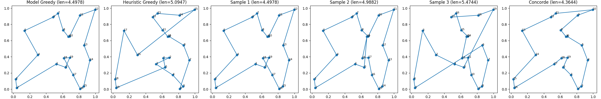
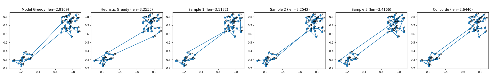
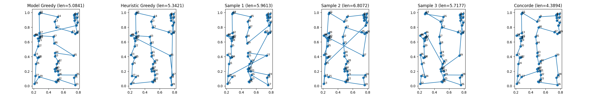
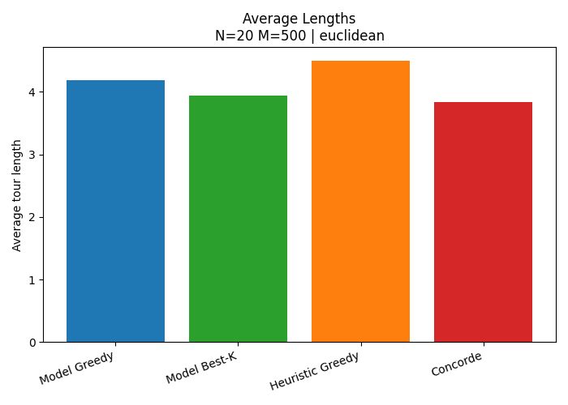
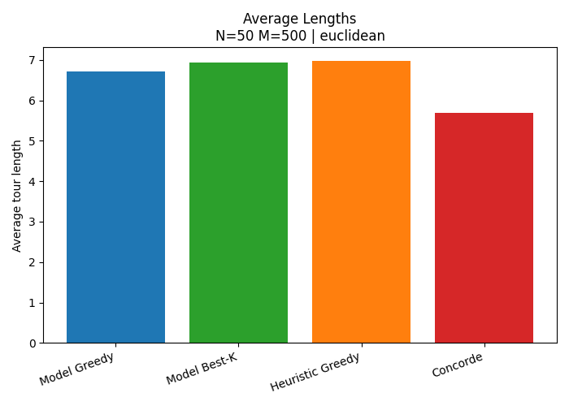
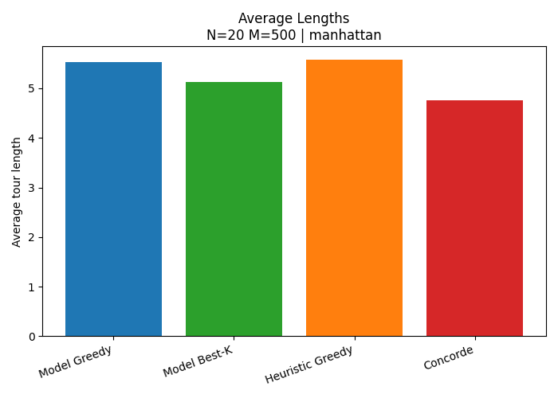
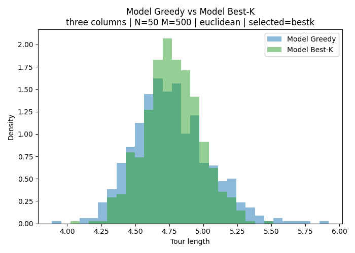
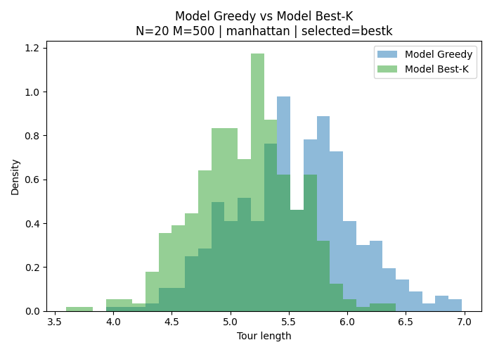
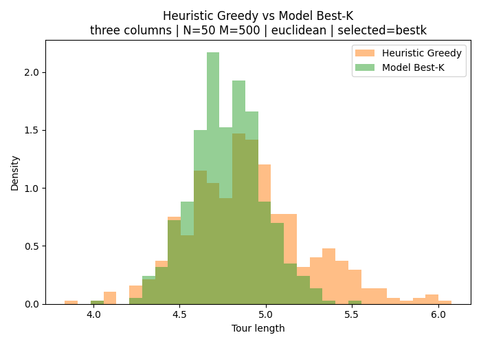
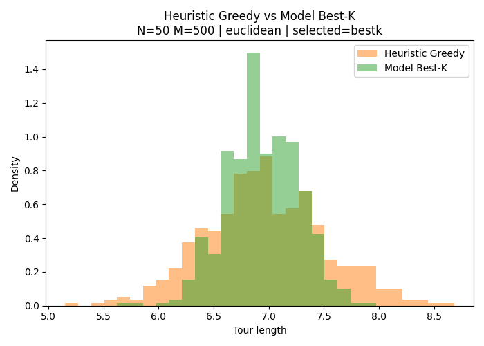

# travelling-salesman-machine-learning

A simple training and evaluation pipeline for the Travelling Salesman Problem (TSP) using an attention-based, probabilistic model.

This project is inspired by:  
Kool, W., van Hoof, H., and Welling, M. (2019),  
Attention, Learn to Solve Routing Problems!

The learned models are compared against:
- the Concorde exact solver
- a classic nearest-neighbour greedy heuristic

---

## Personal objective

I wanted to better understand how machine learning can be used to tackle problems with discrete and highly constrained solution spaces.

In standard supervised learning:
- classification outputs typically lie in a small discrete set (e.g. $\{0,1\}$)
- regression outputs lie in $\mathbb{R}^n$

However, many combinatorial optimization problems have solution spaces that are far more structured.  
For the TSP, the set of valid solutions is the permutation group $S_n$.

There are two main reasons to look at this approach instead of relying solely on deterministic solvers like Concorde:
- Speed at inference time, especially when solving many instances.
- The underlying probability distribution of real life problems might better be captured by machine learning than by human tuned heuristics.

---

## How it works

Instead of predicting a single solution (a tour) directly, the model learns a conditional probability distribution over tours:

$$pi \longmapsto p_\theta(\pi \mid x), \qquad \pi \in S_n. $$

Here:
- $x = (x_1,\dots,x_n)$, with $x_i \in \mathbb{R}^2$, represents a TSP instance (a set of points)
- $\theta$ denotes the model parameters

The distribution is defined autoregressively: at each step, the model assigns probabilities to the next city, conditioned on the partial tour built so far.

### Training objective

The model is trained to minimize the expected tour length:


$$\mathbb{E}_{\pi \sim p_\theta(\cdot \mid x)}\big[L(x,\pi)\big].$$

The training pushes the probability mass toward shorter tours.

The learned distribution is not meant to predict where the optimal tour is.  
Instead, it learns a policy that tends to generate good (low-cost) tours in general.

### Getting a solution

To obtain an actual tour, I decode from the learned distribution using either:
- model greedy: always pick the most likely next city
- best-of-K : sample $K$ tours and keep the shortest one

---

## Experiments

I experimented with four layouts:

- Uniform
  - 20 points uniformly distributed in $[0,1]^2$
  - 50 points uniformly distributed in $[0,1]^2$
- Two islands: two Gaussian clusters
- Three columns: three rectangular uniform regions

For the uniform layouts, I also tested the Manhattan metric in addition to the Euclidean one.

### Training data

For each layout / metric:
- the model was trained on 10,000 randomly generated instances
- except for the 50-point uniform case, where the model was trained on 20-point instances and evaluated on 50-point ones

---

## Tour examples

For each instance:
- model greedy: greedy decoding from the learned distribution
- model samples: three random samples from the model
- heuristic greedy: nearest-neighbour heuristic
- Concorde: exact solver (when available)

### Uniform (Euclidean)


### Uniform (Manhattan)


### Two islands


### Three columns


---

## Evaluation protocol

To evaluate performance:
- I averaged tour lengths over 500 test instances for each algorithm

I evaluated the learned model in two modes:
- model greedy
- best-of-K sampling (with $K = 50$)

---

## Results

### 20 points, uniform (Euclidean)


This result is pretty satisfying.  
The model manages to get quite close to Concorde on average, and clearly outperforms the greedy heuristic.

---

### 50 points, uniform (Euclidean)


The model performs worse here, which is expected: I only trained it on 20-point instances.  
Still, it performs better than the nearest-neighbour heuristic.

---

### 20 points, uniform (Manhattan)


The model performs worse with the Manhattan metric.  
I do not know exactly why, but my guess is that it has to do with regularity properties of the loss function which may make training harder.

---

### Two islands and three columns

The behaviour is similar:
- better than greedy
- worse than Concorde

---

## Tour length distributions

Average tour lengths do not tell the full story.  
Looking at the distribution of tour lengths is also interesting.


One interesting observation is that there is no clear choice to be made between using the best of K samples or model greedy evaluation. 
| Three columns | 20 points Manhattan |
| --- | --- |
|  |  |

One particularly reassuring observation appears in the three-columns layout:



Even when it does not strongly outperform the greedy heuristic on average, the model tends to avoid obvious pitfalls of the greedy approach.  
This suggests that it learned something more subtle than simply going to the nearest neighbour.

Overall, the learned models often produce more consistent (lower-variance) results than the greedy heuristic, even when they are not always better on average.

For example, comparing the greedy heuristic with the model trained on 20-point uniform instances and evaluated on 50-point ones:



---

## Folder layout

You need to create the following directories locally:

- data/ : training datasets (.h5)
- test_data/ : held-out datasets for evaluation
- checkpoints*/ : saved models (ignored by git)
- hist_data/ : saved evaluation arrays (ignored by git)

---

## Generate datasets

Datasets are not stored in git and must be generated locally.

Edit tsp_instance_generator.py and set:
- MODE (uniform, two_islands, three_columns)
- num_points, num_instances
- test = True to write into test_data/ instead of data/

Then run:
```
python tsp_instance_generator.py
```

---

## Train

```
python train.py --data_file data/tsp_20_10000.h5 --save_dir checkpoints
```

Manhattan training:
```
python train.py --data_file data/tsp_20_10000.h5 --distance_metric manhattan --save_dir checkpoints_manhattan
```

Resume training:
```
python train.py --data_file data/tsp_two_islands_50_10000.h5 \
  --save_dir checkpoints_two_islands_50 \
  --resume checkpoints_two_islands_50/ckpt_ep50.pt --epochs 100
```

---

## Visualize tours

```
python visualize.py --model checkpoints/tsp_attention_model.pt \
  --data_file test_data/tsp_20_10000.h5 --indices 0,1,2,3,4
```

---

## Evaluate and save histogram data

```
python evaluate_histograms.py --test_data_dir test_data \
  --checkpoints_dirs checkpoints,checkpoints_manhattan,checkpoints_two_islands_50,checkpoints_three_columns_50 \
  --best_k 50 --max_instances 500 --strict_dataset_match
```

---

## Build plots

```
python plot_hist_data.py --hist_dir hist_data
```

---

## Notes on Concorde

Concorde is optional.  
If available, it is used as a baseline and run in a temporary directory to avoid leaving .res files.

---

This project should be read as an exploration of probabilistic policies for combinatorial optimization rather than a replacement for state-of-the-art deterministic solvers.
